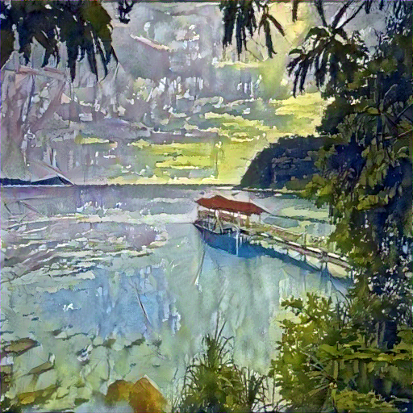

# 🎨 Neural Style Transfer

A Python implementation of the Neural Style Transfer algorithm, which recomposes the content of an image in the style of another. This project uses a pre-trained VGG-19 network to create artistic images.

## ✨ Showcase

Here are some examples of images created with this project.

| Content Image | Style Image | Generated Image |
| :-----------: | :---------: | :-------------: |
|  |  | 

## 📖 Description

This project implements the paper ["A Neural Algorithm of Artistic Style"](https://arxiv.org/abs/1508.06576) by Gatys et al. It uses a convolutional neural network (CNN) to separate and recombine the content and style of arbitrary images. By defining a loss function based on the content of one image and the style of another, we can optimize a new image that merges the two.

## 🛠️ Tools

* **Python 3.8+**
* **PyTorch**
* **NumPy**
* **Pillow**
* **Matplotlib**

## 🏃‍♀️ How to Use

You can run the style transfer from the command line.

**Basic Usage:**
```sh
python main.py --content "path/to/content.jpg" --style "path/to/style.jpg"
